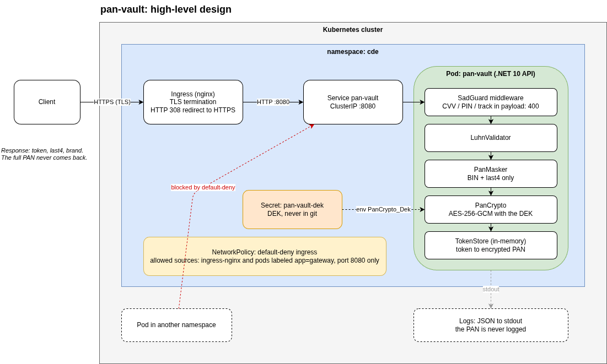

# pan-vault

A cloud-agnostic PAN tokenization service, built to show PCI DSS v4.0.1 controls
with **verifiable evidence** rather than claims. .NET 10, Kubernetes, GitOps.

Every security control in this repository maps to a requirement, to the file that
implements it, and to a command that proves it: see
[docs/pci-dss-v4-mapping.md](docs/pci-dss-v4-mapping.md).

> **This is a reference project, not a product.** It is *aligned to* PCI DSS
> v4.0.1; it is not PCI compliant and does not claim to be. Only industry test
> card numbers are used. What is deliberately out of scope is listed
> [here](docs/pci-dss-v4-mapping.md#out-of-scope).

The thesis behind the design: **portability is not about deploying to N clouds,
it is about the 95% of the system that does not know which cloud it runs on.**
The application, the manifests, the GitOps configuration and the observability
stack in this repository contain no provider-specific line. The CI pipeline proves
it by creating a fresh Kubernetes cluster on every pull request and deploying
everything into it.

## What it does

A card number (PAN) goes in, a token comes out, and nothing downstream ever
touches the PAN again.

**`POST /tokens`**

```http
POST /tokens
Content-Type: application/json

{"pan": "4111111111111111"}
```

```http
201 Created
Location: /tokens/tok_f3ece851ed1a28a3dc73a6c9d3825101

{"token": "tok_f3ece851ed1a28a3dc73a6c9d3825101", "last4": "1111", "brand": "visa"}
```

The PAN is validated (Luhn), encrypted with AES-256-GCM and stored in memory under
a random 128-bit token that has no mathematical relationship to it.

**`GET /tokens/{token}`**

```http
200 OK

{"token": "tok_f3ece851...", "maskedPan": "411111******1111", "brand": "visa", "createdAt": "..."}
```

Only the masked PAN (first six, last four) is ever returned. There is no endpoint
that returns the PAN in the clear.

**What gets rejected with `400`**

- Any payload carrying sensitive authentication data: `cvv`, `cvc`, `pin`,
  `track2` and their variants, at any depth of the JSON, including inside arrays.
  SAD must never be stored, so it is not even accepted.
- A PAN that fails the Luhn check.

## Architecture



| Piece | What it does | Where |
|---|---|---|
| **API** (.NET 10, minimal API) | `SadGuard` middleware, Luhn validation, masking, AES-256-GCM encryption with a versioned and authenticated blob, in-memory token store | `src/PanVault.Api/` |
| **Container image** | Multi-stage build on a chiseled base: non-root, no shell, 8 OS packages, zero HIGH or CRITICAL CVEs | `Dockerfile`, `docs/trivy-report.txt` |
| **Kubernetes manifests** | Namespace `cde`, hardened Deployment (read-only root, no capabilities, no API token), ClusterIP Service, TLS Ingress, default-deny NetworkPolicy | `k8s/` |
| **Secrets** | The DEK, the TLS certificate and the Grafana password live in git only as ciphertext (Sealed Secrets). Locally the start script generates its own | `gitops/secrets/` |
| **GitOps** | ArgoCD reconciles the cluster from this repository: automated sync, pruning and self-healing. Out-of-band changes are reverted | `gitops/` |
| **Observability** | kube-prometheus-stack, a versioned Grafana dashboard, two alerts, and application metrics served on a dedicated port that only Prometheus can reach | `observability/` |
| **CI** | Build, 27 unit tests, secret scan, image scan as a gate, and an end-to-end job that deploys everything to a kind cluster with Calico and verifies every control | `.github/workflows/ci.yaml` |

## Try it in one minute

No Kubernetes, just Docker. The image is public.

```bash
docker run --rm -d --name pan-vault-api -p 8080:8080 \
  -e PanCrypto__Dek="$(openssl rand -base64 32)" \
  ghcr.io/emmanuelepp/pan-vault:latest
```
```bash
curl -s -X POST localhost:8080/tokens \
  -H 'Content-Type: application/json' \
  -d '{"pan":"4111111111111111"}'
```
```bash
# Sensitive authentication data is rejected
curl -s -X POST localhost:8080/tokens \
  -H 'Content-Type: application/json' \
  -d '{"pan":"4111111111111111","cvv":"123"}'
```
```bash
docker stop pan-vault-api
```

The container refuses to start without `PanCrypto__Dek`: the key is never baked
into the image.

## Run the full platform

This brings up the whole system on your machine: a Kubernetes cluster with
network policy enforcement, the API behind a TLS Ingress, ArgoCD, Prometheus,
Grafana and Alertmanager. Zero configuration.

**Prerequisites**

- Docker, running
- [minikube](https://minikube.sigs.k8s.io/docs/start/) and `kubectl`
- `openssl` and `curl`
- About 8 GB of free RAM and 4 CPUs for the cluster (configurable, see below)
- On Linux, inotify limits high enough for a full cluster. The defaults are too
  low when another local cluster is already running, and kube-proxy fails with
  `too many open files`:

  ```bash
  sudo sysctl -w fs.inotify.max_user_instances=512 fs.inotify.max_user_watches=524288
  ```

**Start**

```bash
git clone https://github.com/emmanuelepp/pan-vault.git
cd pan-vault
./scripts/up.sh
```

What the script does, in order:

1. Creates a dedicated minikube profile (`pan-vault`) with Calico, so that
   NetworkPolicies are actually enforced
2. Enables the Ingress controller
3. Installs the Sealed Secrets controller and ArgoCD
4. Generates the secrets this cluster needs: a random DEK, a self-signed TLS
   certificate and a Grafana admin password. They are created in the cluster and
   never written to disk
5. Applies the ArgoCD Applications. From that point on ArgoCD deploys the API,
   the monitoring stack, the dashboard and the alerts from this repository
6. Waits until every Application reports `Synced` and `Healthy`

The first run takes about 10 minutes, most of it pulling images. The script ends
with the commands for the next steps.

To change the cluster size: `MINIKUBE_MEMORY=4g MINIKUBE_CPUS=2 ./scripts/up.sh`.

## Open the apps

```bash
./scripts/open.sh
```

This port-forwards every web UI, prints the credentials, and opens the tabs in
your browser. Run it again whenever you need the port-forwards back;
`./scripts/open.sh --stop` closes them.

| App | URL | User | Password |
|---|---|---|---|
| ArgoCD | https://localhost:8443 | `admin` | printed by the script |
| Grafana | http://localhost:3000 | `admin` | printed by the script |
| Prometheus | http://localhost:9090 | none | none |
| Alertmanager | http://localhost:9093 | none | none |
| Swagger UI (API) | http://localhost:8080/swagger | none | none |

ArgoCD and Grafana use self-signed certificates: accept the browser warning.

Swagger UI is the place to try the API by hand: send a PAN, send one with a
`cvv`, read a token back. It runs as a second copy of the same image on your
machine with the docs flag on, because the instance inside the cluster keeps
Swagger off (see below).

**What to look at**

- **ArgoCD**: four Applications, all green. Click `pan-vault` to see the resource
  tree. Delete the Deployment from the UI or with `kubectl` and watch ArgoCD
  recreate it.
- **Grafana**: Dashboards, then `pan-vault`. Four panels: service up, SAD
  rejections per minute, requests per second by status, p95 latency.
- **Prometheus**: `/targets` shows `pan-vault` being scraped through the
  NetworkPolicy. `/alerts` shows `PanVaultDown` and `PanVaultSadRejectionSpike`.

**Doing it by hand**, if you prefer to see each step:

```bash
kubectl config use-context pan-vault
```
```bash
# ArgoCD
kubectl -n argocd get secret argocd-initial-admin-secret -o jsonpath='{.data.password}' | base64 -d; echo
kubectl -n argocd port-forward svc/argocd-server 8443:443
```
```bash
# Grafana
kubectl -n monitoring get secret grafana-admin -o jsonpath='{.data.admin-password}' | base64 -d; echo
kubectl -n monitoring port-forward svc/monitoring-grafana 3000:80
```
```bash
# Prometheus and Alertmanager
kubectl -n monitoring port-forward svc/monitoring-kube-prometheus-prometheus 9090:9090
kubectl -n monitoring port-forward svc/monitoring-kube-prometheus-alertmanager 9093:9093
```

**Swagger UI** on its own, without the rest of `open.sh`:

```bash
docker run --rm -d --name pan-vault-swagger -p 8080:8080 \
  -e PanCrypto__Dek="$(openssl rand -base64 32)" \
  -e PanVault__EnableApiDocs=true \
  ghcr.io/emmanuelepp/pan-vault:latest
# http://localhost:8080/swagger
```

**The API in the cluster** has no web UI: Swagger only exists when
`PanVault:EnableApiDocs` is set, and the deployed manifests never set it, so
development tooling never reaches production (Req 2.2.4). Both instances behave
the same. Call the one in the cluster through the Ingress:

```bash
IP=$(minikube ip -p pan-vault)
```
```bash
curl -sk --resolve pan-vault.local:443:$IP https://pan-vault.local/healthz
```
```bash
curl -sk --resolve pan-vault.local:443:$IP https://pan-vault.local/tokens \
  -X POST -H 'Content-Type: application/json' -d '{"pan":"4111111111111111"}'
```

Or add `pan-vault.local` to `/etc/hosts` once and drop the `--resolve`:

```bash
echo "$(minikube ip -p pan-vault) pan-vault.local" | sudo tee -a /etc/hosts
```

## Prove the controls

```bash
./scripts/smoke.sh
```

It runs the same checks as the CI pipeline, against your cluster, through the
Ingress:

```
Transport (Req 4.2.1)
  PASS  HTTPS /healthz                                             200
  PASS  HTTP is redirected to HTTPS                                308

Sensitive authentication data is rejected (Req 3.3.1)
  PASS  cvv at the top level                                       400
  PASS  cvv nested in an object                                    400
  PASS  pin inside an array                                        400
  ...

Network segmentation (Req 1.2.1, 1.3.1)
  PASS  pod in another namespace is blocked                        yes
  PASS  authorized pod in the CDE is allowed                       yes

GitOps self-heal (Req 6.5.1, 6.5.2)
  PASS  deleted Deployment is recreated by ArgoCD                  yes
```

Three of them are worth running by hand, because the output is the evidence:

```bash
IP=$(minikube ip -p pan-vault)
```
```bash
# 1. A CVV in the payload is rejected, even nested
curl -sk --resolve pan-vault.local:443:$IP https://pan-vault.local/tokens \
  -X POST -H 'Content-Type: application/json' \
  -d '{"pan":"4111111111111111","card":{"cvv":"123"}}'
# {"error":"sensitive_authentication_data","field":"cvv"}
```
```bash
# 2. No PAN ever reaches the logs
kubectl -n cde logs deploy/pan-vault | grep -E '[0-9]{12,19}' || echo "no card numbers in the logs"
```
```bash
# 3. Network isolation: the same service, reachable or not depending on where you stand
kubectl run probe --rm -i --restart=Never --image=busybox:1.36 -- \
  wget -qO- --timeout=5 http://pan-vault.cde:8080/healthz
# wget: download timed out
```
```bash
kubectl -n cde run probe --rm -i --restart=Never --labels=app=gateway --image=busybox:1.36 -- \
  wget -qO- --timeout=5 http://pan-vault:8080/healthz
# {"status":"ok"}
```

The full list of controls, each with its requirement and its verification
command, is in [docs/pci-dss-v4-mapping.md](docs/pci-dss-v4-mapping.md).

## Repository layout

```
src/PanVault.Api/        the API: Crypto/, Validation/, Tokens/, Program.cs
tests/PanVault.Tests/    xUnit tests for the crypto, validation and token store
Dockerfile               multi-stage build, chiseled runtime, non-root
k8s/                     plain manifests, one resource per file, applied by ArgoCD
gitops/                  ArgoCD Applications and the sealed secrets
observability/           ServiceMonitor, Grafana dashboard (JSON), alert rules
scripts/                 up.sh, open.sh, smoke.sh, down.sh
docs/                    PCI DSS mapping, risk analysis, test cards, scan report, architecture
.github/workflows/       CI: build, tests, secret scan, image scan gate, kind end-to-end
```

## Tear down

```bash
./scripts/down.sh
```

Deletes the minikube profile and everything in it, including the secrets that
were generated for it.

## License

[MIT](LICENSE)
